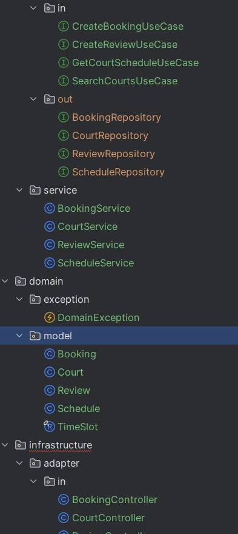

<p align="center">Министерство образования Республики Беларусь</p>
<p align="center">Учреждение образования</p>
<p align="center">"Брестский Государственный технический университет"</p>
<p align="center">Кафедра ИИТ</p>
<br><br><br><br><br><br>
<p align="center"><strong>Лабораторная работа №2</strong></p>
<p align="center"><strong>По дисциплине:</strong> "Проектирование интернет-систем"</p>
<p align="center"><strong>Тема:</strong> "Гексагональная архитектура: проектирование портов и адаптеров"</p>
<br><br><br><br><br><br>
<p align="right"><strong>Выполнил:</strong></p>
<p align="right">Студент 3 курса</p>
<p align="right">Группа ПО-13</p>
<p align="right">Шумило М.А.</p>
<p align="right"><strong>Проверил:</strong></p>
<p align="right">Шорох Д.В.</p>
<br><br><br><br><br>
<p align="center"><strong>Брест 2026</strong></p>

---

## Цель работы

Спроектировать архитектуру основного сервиса системы с использованием гексагональной (hexagonal) архитектуры: создать структуру проекта, определить порты (интерфейсы) и продемонстрировать изоляцию слоёв через минимальные примеры.

---

### Вариант №23 - Спортплощадки «Играем?» 🏀

**Питч:** Игра начнётся, как только вы забронируете.

**Ядро домена:** Площадки, Расписание, Брони, Отзывы

**Выбранный сервис:** Booking Service

---

## Ход выполнения работы

### Часть 1. Архитектурная диаграмма

**Описание сервиса:** Booking Service управляет жизненным циклом бронирования спортивных площадок: поиск площадок, просмотр расписания, создание бронирований и управление отзывами пользователей.Основные сущности: Court (Площадка), Schedule (Расписание), Booking (Бронь), Review (Отзыв).


**Диаграмма слоёв:**
```
┌──────────────────────────────────────────────────────────────┐
│                     Infrastructure Layer                     │
│  ┌──────────────────┐   ┌──────────────────────────────────┐ │
│  │ REST API         │   │ CourtRepository (DB / InMemory)  │ │
│  │ Controllers      │   │ ScheduleRepository               │ │
│  └───────────┬──────┘   │ BookingRepository                │ │
│              │          │ ReviewRepository                 │ │
│              │          └──────────────────────────────────┘ │
└──────────────┼───────────────────────────────────────────────┘
               │
               ▼
┌──────────────────────────────────────────────────────────────┐
│                     Application Layer                        │
│  ┌──────────────────┐   ┌──────────────────────────────────┐ │
│  │ In Ports         │   │ Out Ports                        │ │
│  │ (Use Cases)      │   │ (Repositories, Notifications)    │ │
│  └───────────┬──────┘   └──────────────────────────────────┘ │
│              │                                               │
│  ┌───────────▼────────────────────────────────────────────┐  │
│  │   CourtService (управление площадками)                 │  │
│  │   ScheduleService (слоты и доступность)                │  │
│  │   BookingService (оркестратор бронирований)            │  │
│  │   ReviewService (работа с отзывами)                    │  │
│  └────────────────────────────────────────────────────────┘  │
└───────────────────────────┬──────────────────────────────────┘
                            │
                            ▼
┌──────────────────────────────────────────────────────────────┐
│                         Domain Layer                         │
│  ┌──────────────┐  ┌──────────────┐  ┌──────────────┐        │
│  │ Court        │  │ Schedule     │  │ Booking      │        │
│  │ (Aggregate)  │  │ (Entity)     │  │ (Aggregate)  │        │
│  └──────────────┘  └──────────────┘  └──────────────┘        │
│  ┌──────────────┐                                            │
│  │ Review       │                                            │
│  │ (Entity/VO)  │                                            │
│  └──────────────┘                                            │
└──────────────────────────────────────────────────────────────┘

```

---

### Часть 2. Структура проекта (скелет)

**Технология:** Java

**Структура папок:**

```
_[Вставьте дерево папок вашего проекта]_

playgrounds-service/
├──playgrounds/src/
│   ├── main/
│   │   ├── java/
│   │   │   └── com/example/playgrounds/
│   │   │       ├── domain/                           # Domain Layer
│   │   │       │   ├── model/                        # Доменные сущности
│   │   │       │   │   ├── Court.java                # class Court {}
│   │   │       │   │   ├── Schedule.java             # class Schedule {}
│   │   │       │   │   ├── Booking.java              # class Booking {}
│   │   │       │   │   └── Review.java               # class Review {}
│   │   │       │   └── exception/
│   │   │       │       └── DomainException.java      # class DomainException extends RuntimeException {}
│   │   │
│   │   │       ├── application/                      # Application Layer
│   │   │       │   ├── port/
│   │   │       │   │   ├── in/                       # Входящие порты (use-cases)
│   │   │       │   │   │   ├── CreateBookingUseCase.java
│   │   │       │   │   │   ├── GetCourtScheduleUseCase.java
│   │   │       │   │   │   ├── CreateReviewUseCase.java
│   │   │       │   │   │   └── SearchCourtsUseCase.java
│   │   │       │   │   └── out/                      # Исходящие порты (зависимости)
│   │   │       │   │       ├── CourtRepository.java
│   │   │       │   │       ├── ScheduleRepository.java
│   │   │       │   │       ├── BookingRepository.java
│   │   │       │   │       └── ReviewRepository.java
│   │   │       │   └── service/                      # Реализация use-cases
│   │   │       │       ├── BookingService.java       # TODO: implement
│   │   │       │       ├── CourtService.java         # TODO: implement
│   │   │       │       ├── ScheduleService.java      # TODO: implement
│   │   │       │       └── ReviewService.java        # TODO: implement
│   │   │
│   │   │       └── infrastructure/                   # Infrastructure Layer
│   │   │           ├── adapter/
│   │   │           │   ├── in/                       # Входящие адаптеры (REST)
│   │   │           │   │   ├── CourtController.java
│   │   │           │   │   ├── BookingController.java
│   │   │           │   │   ├── ScheduleController.java
│   │   │           │   │   └── ReviewController.java
│   │   │           │   └── out/                      # Исходящие адаптеры (репозитории)
│   │   │           │       ├── InMemoryCourtRepository.java
│   │   │           │       ├── InMemoryScheduleRepository.java
│   │   │           │       ├── InMemoryBookingRepository.java
│   │   │           │       └── InMemoryReviewRepository.java
│   │   │           └── config/
│   │   │               └── DependencyInjectionConfig.java   # Скелет DI (Spring / manual)
│   │   │
│   │   └── resources/...
│   │      
│   │
│   └── test/...
|   |___pom.xml
│     
│
├── README.md
└── Architecture.md

```

**Скриншот структуры в IDE**:



---

### Часть 3. Domain Layer (Доменный слой)

#### Доменные сущности

**Entity 1**: Court (Площадка)

```java
package com.example.playgrounds.domain.model;

public class Court {
    private final Long id;
    private final String name;
    private final String location;

    public Court(Long id, String name, String location) {
        this.id = id;
        this.name = name;
        this.location = location;
    }

    public Long getId() { return id; }
    public String getName() { return name; }
    public String getLocation() { return location; }
}
```

**Value Object 1**: TimeSlot

```java
// TimeSlot.java
package com.example.playgrounds.domain.model;

import java.time.LocalDateTime;

public record TimeSlot(LocalDateTime start, LocalDateTime end) {}

```

**Доменные исключения**:
- DomainException
  

#### Бизнес-правила

Перечислите основные бизнес-правила, реализованные в domain слое:

1. Нельзя создать бронь, если площадка недоступна в выбранный интервал.
2. Время начала брони должно быть раньше времени окончания.
3. Нельзя забронировать площадку задним числом.
4. Отзыв можно оставить только после завершения брони.
---

### Часть 4. Application Layer (Прикладной слой)

#### Входящие порты (Inbound Ports)

Интерфейсы, которые предоставляет система внешнему миру:

**CreateBookingUseCase**:
```java
public interface CreateBookingUseCase {
    Long create(CreateBookingCommand command);
}
```

**GetCourtScheduleUseCase**:
```java
public interface GetCourtScheduleUseCase {
    Schedule getSchedule(Long courtId);
}

```

**CreateReviewUseCase**:
```java
public interface CreateReviewUseCase {
  Review create(CreateReviewCommand command);
}

```
**SearchCourtsUseCase**:
```java
public interface SearchCourtsUseCase {
  List<Court> search(String query);
}


```
#### Исходящие порты (Outbound Ports)

Интерфейсы, через которые система взаимодействует с внешним миром:

**BookingRepository**:
```java
public interface BookingRepository {
  Booking save(Booking booking);
  boolean isSlotAvailable(Long courtId, Booking booking);
}

```

**CourtRepository**:
```java
public interface CourtRepository {
  Court findById(Long id);
  List<Court> searchByName(String query);
  Court save(Court court);
}

```
**ReviewRepository**:
```java
public interface ReviewRepository {
  Review save(Review review);
  List<Review> findByCourtId(Long courtId);
}

```
**ScheduleRepository**:
```java
public interface ScheduleRepository {
  Schedule findByCourtId(Long courtId);
  Schedule save(Schedule schedule);
}

```

#### Application Service

**BookingService** (реализует входящие порты):

```java
public class BookingService implements CreateBookingUseCase {
  @Override
  public Booking create(CreateBookingCommand command) {
    return null;
  }
}

```

**Основная логика**:
  Получает команду создания брони и добавляет бронь в базу через исходящий порт

---

### Часть 5. Infrastructure Layer (Инфраструктурный слой)

#### Входящий адаптер: REST API

**BookingController**:

```java
@RestController
@RequestMapping("/api/bookings")
public class BookingController {

  private final CreateBookingUseCase createBookingUseCase;

  public BookingController(CreateBookingUseCase createBookingUseCase) {
    this.createBookingUseCase = createBookingUseCase;
  }

  @PostMapping
  public Long create(@RequestBody CreateBookingRequest request) {
    return createBookingUseCase.create(request.toCommand());
  }
}
```

**Эндпоинты**:
- `POST /api/bookings` - создание брони


**Пример запроса/ответа**:

```json
POST /api/bookings
{
  "courtId": 1,
  "userId": 42,
  "start": "2025-03-10T10:00",
  "end": "2025-03-10T11:00"
}

Ответ:
{
  "bookingId": 1001
}
```

#### Исходящий адаптер: Repository

**courtRepository**:

```java
public class courtRepository implements CourtRepository {

  private final Map<Long, Court> storage = new HashMap<>();

  @Override
  public Court findById(Long id) {
    return storage.get(id);
  }

  @Override
  public List<Court> searchByName(String query) {
    return storage.values().stream()
      .filter(c -> c.getName().toLowerCase().contains(query.toLowerCase()))
      .toList();
  }

  @Override
  public Court save(Court court) {
    return null;
  }


}
```

**Принцип работы**:
Данные хранятся в базе данных


### Часть 6. Dependency Injection (Конфигурация зависимостей)

**BeanConfiguration** (или DI-контейнер):

```java
@Configuration
public class DependencyInjectionConfig {

  @Bean
  public CourtRepository courtRepository() {
    return new сourtRepository();
  }

  @Bean
  public SearchCourtsUseCase searchCourtsUseCase(CourtRepository repo) {
    return new CourtService(repo);
  }

  @Bean
  public CourtController courtController(SearchCourtsUseCase useCase) {
    return new CourtController(useCase);
  }
}
```

**Как работает DI**:
 Создаются бины контроллеров и в них внедряются реализации портов

---

### Часть 7. Тестирование

#### Юнит-тесты для  BookingService

```java
@Test
void testCreateBookingSuccess() {
    BookingRepository repo = mock(BookingRepository.class);
    CourtRepository courts = mock(CourtRepository.class);

    when(courts.findById(1L)).thenReturn(new Court(1L, "Arena", "Center"));
    when(repo.isCourtAvailable(any(), any())).thenReturn(true);

    BookingService service = new BookingService(repo, courts);

    CreateBookingCommand cmd = new CreateBookingCommand(1L, 42L, start, end);

    assertDoesNotThrow(() -> service.create(cmd));
}

```

**Что тестируется**:
- ✅ Успешное создание брони
- ✅ Проверка доступности площадки
- ✅ Вызов репозитория сохранения

**Mock-объекты**:
  BookingRepository
  CourtRepository


## 3. Архитектурная диаграмма

### Диаграмма слоёв
```
┌──────────────────────────────────────────────────────────────┐
│                     Infrastructure Layer                     │
│  ┌──────────────────┐   ┌──────────────────────────────────┐ │
│  │ REST API         │   │ CourtRepository (DB / InMemory)  │ │
│  │ Controllers      │   │ ScheduleRepository               │ │
│  └───────────┬──────┘   │ BookingRepository                │ │
│              │          │ ReviewRepository                 │ │
│              │          └──────────────────────────────────┘ │
└──────────────┼───────────────────────────────────────────────┘
               │
               ▼
┌──────────────────────────────────────────────────────────────┐
│                     Application Layer                        │
│  ┌──────────────────┐   ┌──────────────────────────────────┐ │
│  │ In Ports         │   │ Out Ports                        │ │
│  │ (Use Cases)      │   │ (Repositories, Notifications)    │ │
│  └───────────┬──────┘   └──────────────────────────────────┘ │
│              │                                               │
│  ┌───────────▼────────────────────────────────────────────┐  │
│  │   CourtService (управление площадками)                 │  │
│  │   ScheduleService (слоты и доступность)                │  │
│  │   BookingService (оркестратор бронирований)            │  │
│  │   ReviewService (работа с отзывами)                    │  │
│  └────────────────────────────────────────────────────────┘  │
└───────────────────────────┬──────────────────────────────────┘
                            │
                            ▼
┌──────────────────────────────────────────────────────────────┐
│                         Domain Layer                         │
│  ┌──────────────┐  ┌──────────────┐  ┌──────────────┐        │
│  │ Court        │  │ Schedule     │  │ Booking      │        │
│  │ (Aggregate)  │  │ (Entity)     │  │ (Aggregate)  │        │
│  └──────────────┘  └──────────────┘  └──────────────┘        │
│  ┌──────────────┐                                            │
│  │ Review       │                                            │
│  │ (Entity/VO)  │                                            │
│  └──────────────┘                                            │
└──────────────────────────────────────────────────────────────┘
```

### Описание портов и адаптеров
| Тип | Название | Назначение |
| --- | --- | --- |
| **Входящий порт** | ICreateBookingUseCase | *Интерфейс для создания бронирования площадки* |
| **Входящий порт** | IGetCourtScheduleUseCase | *Интерфейс для получения расписания площадки* |
| **Входящий порт** | ISearchCourtsUseCase | *Интерфейс для поиска спортивных площадок* |
| **Исходящий порт** | ICourtRepository | *Интерфейс для доступа к данным площадок* |
| **Исходящий порт** | IBookingRepository | *Интерфейс для хранения и проверки броней* |
| **Исходящий порт** | IScheduleRepository | *Интерфейс для работы с расписанием площадок* |
| **Исходящий порт** | IReviewRepository | *Интерфейс для хранения отзывов* |
| **Входящий адаптер** | CourtController (REST) | *REST API для поиска площадок* |
| **Входящий адаптер** | BookingController (REST) | *REST API для создания и получения бронирований* |
| **Входящий адаптер** | ScheduleController (REST) | *REST API для получения расписания площадки* |
| **Входящий адаптер** | ReviewController (REST) | *REST API для создания и просмотра отзывов* |
| **Исходящий адаптер** | InMemoryCourtRepository | *Реализация хранилища площадок в памяти* |
| **Исходящий адаптер** | InMemoryBookingRepository | *Реализация хранилища броней в памяти* |
| **Исходящий адаптер** | InMemoryScheduleRepository | *Реализация расписания в памяти* |
| **Исходящий адаптер** | InMemoryReviewRepository | *Реализация хранилища отзывов в памяти* |

---

## 4. Критерии выполнения

| Критерий | Выполнено | Комментарий |
|----------|-----------|-------------|
| Структура проекта (domain/application/infrastructure) | ✅ | 
| Domain Layer (чистая бизнес-логика) |  ✅ | 
| Порты (входящие и исходящие интерфейсы) | ✅ |
| Адаптеры (минимум 1 входящий + 2 исходящих) | ✅ | 
| DI-конфигурация (зависимости инжектятся) |  ✅ | 
| Юнит-тесты для BookingService с моками |  ✅ | 
| Документация (диаграмма, описание) | ✅ | 

**Итого**: 7 / 7


## 6. Выводы

### Что получилось хорошо

Удалось чётко разделить доменный слой (Court, Booking, TimeSlot) и инфраструктуру. Domain‑модели не содержат зависимостей от Spring или БД.Application‑сервисы (BookingService, CourtService) легко тестируются с моками, так как работают только через порты.Структура проекта получилась чистой и соответствует Hexagonal Architecture.

### С какими трудностями столкнулись

Первоначально было сложно понять, зачем создавать отдельные интерфейсы для портов, если есть только одна реализация.Также возникли сложности с тем, как правильно разделить ответственность между сервисами и доменными моделями.Настройка DI в Spring потребовала понимания того, как бины связываются через интерфейсы.

### Что узнали нового

Узнал, как работает Hexagonal Architecture и почему важно отделять бизнес‑логику от инфраструктуры.
Разобрался в принципе Dependency Inversion: доменный слой не должен зависеть от деталей реализации.
Понял, как порты позволяют легко подменять адаптеры (например, InMemory → PostgreSQL).
Освоил базовые принципы DI в Spring и понял, как они помогают тестировать приложение.

### Как можно улучшить

Добавить реальную БД (PostgreSQL) вместо InMemory‑репозиториев.Реализовать полноценную проверку доступности площадок с учётом расписания. Добавить интеграционные тесты с TestContainers.
Ввести систему уведомлений (email/SMS) и вынести её в отдельный адаптер.Добавить валидацию входящих DTO и централизованную обработку ошибок.

---

### Ссылка на репозиторий

_[https://github.com/AllFather88/PIS-2026/blob/main/students/Shumilo_Mark/lab-02/]_

**Дата сдачи**: 19.03.2026 
**Подпись студента**: Шумило М.А.
