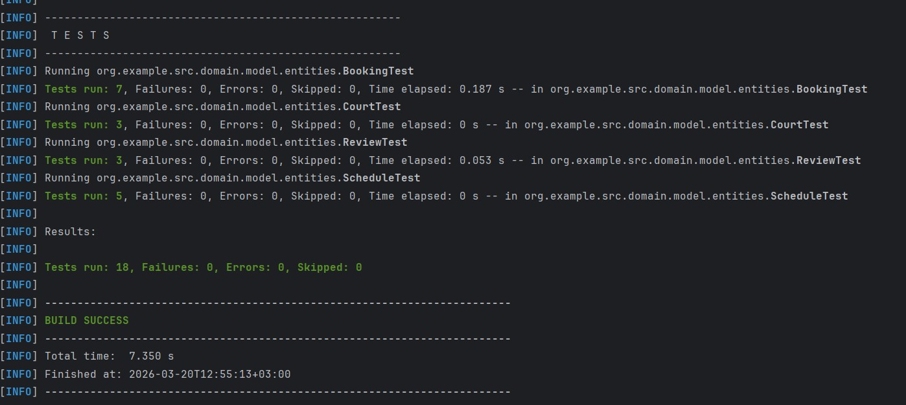

<p align="center">Министерство образования Республики Беларусь</p>
<p align="center">Учреждение образования</p>
<p align="center">"Брестский Государственный технический университет"</p>
<p align="center">Кафедра ИИТ</p>
<br><br><br><br><br><br>
<p align="center"><strong>Лабораторная работа №3</strong></p>
<p align="center"><strong>По дисциплине:</strong> "Проектирование интернет-систем"</p>
<p align="center"><strong>Тема:</strong> "Реализация Domain Layer с DDD-паттернами"</p>
<br><br><br><br><br><br>
<p align="right"><strong>Выполнил:</strong></p>
<p align="right">Студент 3 курса</p>
<p align="right">Группа ПО-13</p>
<p align="right">Шумило М.А.</p>
<p align="right"><strong>Проверил:</strong></p>
<p align="right">Шорох Д.В.</p>
<br><br><br><br><br>
<p align="center"><strong>Брест 2026</strong></p>

---

## Цель работы

Научиться применять тактические паттерны DDD (Entities, Value Objects, Aggregates, Domain Events) для реализации **доменного слоя** с инвариантами и доменной логикой.

---

## Вариант №23 - Спортплощадки «Играем?» 🏀

**Питч:** Игра начнётся, как только вы забронируете.

**Ядро домена:** Площадки, Расписание, Брони, Отзывы

---

## Ход выполнения работы

### 1. Value Objects (Ценностные Объекты)

**Созданные Value Objects:**

1. **TimeSlot** – _интервал времени_
   - **Назначение:** определяет временной промежуток для бронирования или расписания  
   - **Валидация:**  
     - `start < end`  
     - оба значения не `null`  
   - **Иммутабельность:**✅  
   - **Файл:** `domain/value_objects/TimeSlot.java`

2. **ReviewText** – _текст отзыва_
   - **Назначение:** хранит текст отзыва  
   - **Валидация:**  
     - длина ≥ 5 символов  
     - текст не `null`  
   - **Иммутабельность:** ✅  
   - **Файл:** `domain/value_objects/ReviewText.java`

3. **Location** – _адрес площадки_
   - **Назначение:** хранит строковое описание адреса  
   - **Валидация:**  
     - строка не пустая  
     - не `null`  
   - **Иммутабельность:** ✅  
   - **Файл:** `domain/value_objects/Location.java`

4. **CourtName** – _название площадки_
   - **Назначение:** имя спортивной площадки  
   - **Валидация:**  
     - строка не пустая  
     - длина ≥ 3 символов  
   - **Иммутабельность:** ✅  
   - **Файл:** `domain/value_objects/CourtName.java`

5.  **Rating** – _оценка отзыва_
   - **Назначение:** числовая оценка качества площадки, выставленная пользователем  
   - **Валидация:**  
     - значение должно быть от **1 до 5**  
     - `null` недопустим  
   - **Иммутабельность:** ✅  
   - **Файл:** `domain/value_objects/Rating.java`
---


**Пример кода** (один Value Object):
```java
public record TimeSlot(LocalDateTime start, LocalDateTime end) {

  public TimeSlot {
    if (start == null || end == null)
      throw new IllegalArgumentException("Start and end cannot be null");
    if (!start.isBefore(end))
      throw new IllegalArgumentException("Start must be before end");
  }

  public boolean overlaps(TimeSlot other) {
    return start.isBefore(other.end) && other.start.isBefore(end);
  }
}
```

### 2. Entities (Сущности)

**Созданные Entity:**

---

### 1. **Court** – _спортивная площадка_
   - ID поле: `id`
   - Бизнес-правила:
     - площадку нельзя переименовать, если она деактивирована  
     - площадку нельзя деактивировать повторно  
     - имя и адрес не могут быть пустыми  
   - Файл: `domain/entities/Court.java`


### 2. **Booking** – _бронирование площадки_
   - ID поле: `id`
   - Бизнес-правила:
     - нельзя завершить бронь до окончания временного слота  
     - нельзя отменить завершённую бронь  
     - бронь должна иметь валидный TimeSlot  
     - courtId и userId обязательны  
   - Файл: `domain/entities/Booking.java`


### 3. **Review** – _отзыв пользователя о площадке_
   - ID поле: `id`
   - Бизнес-правила:
     - отзыв можно редактировать только новым текстом  
     - текст должен быть ≥ 5 символов  
     - рейтинг должен быть от 1 до 5  
     - отзыв должен быть привязан к существующей броне  
   - Файл: `domain/entities/Review.java`

### 4. **Schedule** – _расписание площадки_
   - ID поле: `id`
   - Бизнес‑правила:
      - расписание принадлежит конкретной площадке (`courtId` обязателен)
      - нельзя добавлять временные слоты, которые пересекаются друг с другом  
      - нельзя добавлять слоты, если расписание заблокировано  
      - нельзя блокировать уже заблокированное расписание  
      - нельзя разблокировать уже разблокированное  
      - каждый слот должен быть валидным `TimeSlot`  
   - Файл: `domain/entities/Schedule.java`
---

**Пример кода** (одна Entity):
```java
public class Court {

  private final Long id;
  private CourtName name;
  private Location location;
  private boolean active = true;

  private final List<Object> events = new ArrayList<>();

  public Court(Long id, CourtName name, Location location) {
    if (id == null) throw new IllegalArgumentException("Court ID cannot be null");

    this.id = id;
    this.name = name;
    this.location = location;
  }

  public void deactivate() {
    if (!active) throw new IllegalStateException("Court already inactive");

    this.active = false;
    events.add(new CourtDeactivatedEvent(id));
  }

  public void rename(CourtName newName) {
    if (!active) throw new IllegalStateException("Cannot rename inactive court");

    this.name = newName;
    events.add(new CourtRenamedEvent(id, newName.value()));
  }

  public boolean isActive() { return active; }

  public List<Object> getEvents() {
    return List.copyOf(events);
  }

  @Override
  public boolean equals(Object o) {
    return o instanceof Court c && Objects.equals(id, c.id);
  }

  @Override
  public int hashCode() {
    return Objects.hash(id);
  }

  public CourtName getName() {
    return name;
  }
}
```

### 3. Aggregate Root (Корневой агрегат)

**Aggregate Root:** _Booking_

**Границы агрегата:**
- Корень: `Booking`
- Внутренние сущности: `_нет (агрегат состоит только из корневой сущности)_`
- Value Objects: `TimeSlot`, `Rating`

**Инварианты агрегата:**

| № | Инвариант | Как проверяется |
| --- | --- | --- |
| 1 | **ID, courtId, userId не могут быть null** | В конструкторе (``if ``(id ``== ``null) ``throw ``...``) |
| 2 | **TimeSlot обязателен и должен быть валидным** | В конструкторе (``slot ``== ``null`` → исключение). Валидация внутри ``TimeSlot`` |
| 3 | **При создании бронь всегда в статусе CREATED** | Поле ``status ``= ``BookingStatus.CREATED`` |
| 4 | **При создании должен регистрироваться BookingCreatedEvent** | В конструкторе (``events.add(new ``BookingCreatedEvent(...))``) |
| 5 | **Нельзя подтвердить бронь, если она не в статусе CREATED** | В ``confirm()`` (``if ``(status ``!= ``CREATED) ``throw ``...``) |
| 6 | **Нельзя отменить завершённую бронь** | В ``cancel()`` (``if ``(status ``== ``COMPLETED) ``throw ``...``) |
| 7 | **Нельзя завершить бронь до окончания временного слота** | В ``complete()`` (``if ``(now ``< ``slot.end()) ``throw ``...``) |
| 8 | **Каждое изменение статуса генерирует доменное событие** | В ``confirm()``, ``cancel()``, ``complete()`` добавляются события |

**Пример кода Aggregate Root:**
```java
public class Booking {

  private final Long id;
  private final Long courtId;
  private final Long userId;
  private TimeSlot slot;

  private BookingStatus status = BookingStatus.CREATED;

  private final List<DomainEvent> events = new ArrayList<>();

  public Booking(Long id, Long courtId, Long userId, TimeSlot slot) {
    if (id == null) throw new IllegalArgumentException("Booking ID cannot be null");
    if (courtId == null) throw new IllegalArgumentException("Court ID cannot be null");
    if (userId == null) throw new IllegalArgumentException("User ID cannot be null");
    if (slot == null) throw new IllegalArgumentException("TimeSlot cannot be null");

    this.id = id;
    this.courtId = courtId;
    this.userId = userId;
    this.slot = slot;

    events.add(new BookingCreatedEvent(id, courtId, userId));
  }
  public BookingStatus getStatus(){
    return status;
  }
  public void cancel(String reason) {
    if (status == BookingStatus.COMPLETED)
      throw new IllegalStateException("Cannot cancel completed booking");

    status = BookingStatus.CANCELLED;
    events.add(new BookingCancelledEvent(id, reason));
  }

  public void confirm() {
    if (status != BookingStatus.CREATED)
      throw new IllegalStateException("Only CREATED bookings can be confirmed");

    status = BookingStatus.CONFIRMED;
    events.add(new BookingConfirmedEvent(id));
  }
  public void complete() {
    if (LocalDateTime.now().isBefore(slot.end()))
      throw new IllegalStateException("Cannot complete booking before it ends");

    status = BookingStatus.COMPLETED;
    events.add(new BookingCompletedEvent(id));
  }

  public List<DomainEvent> getEvents() {
    return List.copyOf(events);
  }

  public void clearEvents() {
    events.clear();
  }

  @Override
  public boolean equals(Object o) {
    return o instanceof Booking b && Objects.equals(id, b.id);
  }

  @Override
  public int hashCode() {
    return Objects.hash(id);
  }
}
```
### 4. Domain Events (Доменные события)

**Созданные события:**

---
1. **BookingCreatedEvent** – _генерируется при создании новой брони_
   - Данные: `booking_id`,`court_id`,`user_id`,`occurred_on`  
   - Когда возникает: в конструкторе `Booking`  
   - Файл: `domain/events/BookingCreatedEvent.java`


2. **BookingConfirmedEvent** – _генерируется при подтверждении брони_
   - Данные:`booking_id`,`occurred_on`  
   - Когда возникает: в методе `confirm()`  
   - Файл: `domain/events/BookingConfirmedEvent.java`


3. **BookingCompletedEvent** – _генерируется при завершении брони_
   - Данные:`booking_id`,`occurred_on`  
   - Когда возникает: в методе `complete()`  
   - Файл: `domain/events/BookingCompletedEvent.java`


4. **BookingCancelledEvent** – _генерируется при отмене брони_
   - Данные:`booking_id`,`reason`,`occurred_on`  
   - Когда возникает: в методе `cancel()`  
   - Файл: `domain/events/BookingCancelledEvent.java`

---

**Пример кода события:**
```java
public class BookingCreatedEvent implements DomainEvent {

  private final Long bookingId;
  private final Long courtId;
  private final Long userId;
  private final Instant occurredOn;

  public BookingCreatedEvent(Long bookingId, Long courtId, Long userId) {
    this.bookingId = bookingId;
    this.courtId = courtId;
    this.userId = userId;
    this.occurredOn = Instant.now();
  }

  public Long getBookingId() {
    return bookingId;
  }

  public Long getCourtId() {
    return courtId;
  }

  public Long getUserId() {
    return userId;
  }

  @Override
  public Instant occurredOn() {
    return occurredOn;
  }
}
```
### 5. Юнит-тесты

**Покрытие тестами:**

| Компонент | Количество тестов | Покрытие | Статус |
|-----------|-------------------|----------|--------|
| Value Objects | 10 | 100% | ✅ |
| Entities | 18 | 100% | ✅ |
| Aggregate Root | 7 | 100% | ✅ |
| Domain Events | 4 | 100% | ✅ |

**Скриншот mwn test:**


---

## Таблица критериев оценки

| Критерий | Баллы | Выполнено |
|----------|-------|-----------|
| Value Objects: корректная валидация, иммутабельность | 20 | ✅ |
| Entities: identity-based equality, инварианты | 20 | ✅ |
| Aggregate Root: границы, инварианты, публичные методы | 25 | ✅ |
| Domain Events: регистрация событий при изменении состояния | 15 | ✅ |
| Юнит-тесты: покрытие инвариантов, edge-cases | 15 | ✅ |
| Качество документации | 5 |  ✅ |
| **ИТОГО** | **100** | |

---

## Бонусы

| Бонус | Баллы | Выполнено |
|-------|-------|-----------|
| Repository интерфейс (только интерфейс без реализации) | +5 |  ✅ |
| Specification Pattern для запросов | +4 | ❌  |
| Domain Services для сложной логики | +3 | ❌ |
| Event Bus (in-memory) для публикации событий | +3 | ❌  |

**ИТОГО бонусов:** 5 / 15

---

## Контрольные вопросы

1. **В чём отличие Value Object от Entity?**
    - **Value Object** определяется *значением* и не имеет собственного идентификатора.  
    - **Entity** определяется *личностью* (ID) и сохраняет свою идентичность даже при изменении состояния.

2. **Почему Aggregate Root должен инкапсулировать доступ к внутренним сущностям?**
    - Чтобы гарантировать соблюдение **инвариантов агрегата** и не позволить внешнему коду изменять состояние напрямую.Все изменения проходят через методы Aggregate Root, что обеспечивает целостность данных и корректные переходы состояний.

3. **Какая роль Domain Events? Приведите пример из вашей системы.**
   - Domain Events фиксируют **значимые изменения в доменной модели**, чтобы другие части системы могли реагировать на них, не нарушая изоляцию домена.

4. **Как вы проверяете инварианты в вашем агрегате? Приведите пример.**
   - Инварианты проверяются в **конструкторе** и **методах изменения состояния**.
    Пример:  
    В методе `complete()` проверяется, что текущее время позже `slot.end()`, иначе бросается исключение: "Cannot complete booking before it ends"

5. **Почему Value Objects делаются иммутабельными?**
   - Потому что они представляют **значения**, а не сущности. Иммутабельность гарантирует, что значение не изменится неожиданно, что делает модель предсказуемой, безопасной и удобной для использования в инвариантах и сравнениях.

---
## Ссылка на репозиторий

👉 **GitHub:** [URL репозитория](https://github.com/AllFather88/PIS-2026/)

**Структура папки:**
```
lab-03/
├── test.jpg
├── Отчет.md
├── domain/
│    ├── exception/
│    │   └── DomainException.java
│    ├── model/
│    │   ├── aggregates/
│    │   ├── Booking.java
│    │   ├── Court.java
│    │   ├── Review.java
│    │   └── Schedule.java
│    ├── events/
│    │   ├── BookingCancelledEvent.java
│    │   ├── BookingCompletedEvent.java
│    │   ├── BookingConfirmedEvent.java
│    │   ├── BookingCreatedEvent.java
│    │   ├── BookingStatus.java
│    │   ├── CourtDeactivatedEvent.java
│    │   ├── CourtRenamedEvent.java
│    │   ├── DomainEvent.java
│    │   ├── ReviewEditedEvent.java
│    │   ├── ScheduleLockedEvent.java
│    │   ├── ScheduleUnlockedEvent.java
│    │   └── TimeSlotAddedEvent.java
│    └── value_objects/
│        ├── CourtName.java
│        ├── Location.java
│        ├── Rating.java
│        ├── ReviewText.java
│        └── TimeSlot.java
└── tests/
    ├── BookingTest.java
    ├── CourtTest.java
    ├── ReviewTest.java
    └── SheduleTest.java
```
---
## Вывод

Реализован доменный слой, включающий агрегат `Booking`, набор Value Objects и систему доменных событий. Все инварианты агрегата строго соблюдаются: обязательные параметры проверяются в конструкторе, корректность переходов состояний контролируется методами `confirm()`, `cancel()` и `complete()`, а временные ограничения обеспечиваются через `TimeSlot`. Доменный слой полностью изолирован от технических деталей — агрегат не зависит от БД, фреймворков или инфраструктурных компонентов, а взаимодействие с внешними системами осуществляется через доменные события. Полученная модель получилась чистой, расширяемой и соответствующей принципам DDD.


---

**Дата выполнения:** 20.03.2026 
**Оценка:** _____________  
**Подпись преподавателя:** _____________


