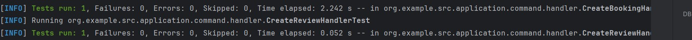
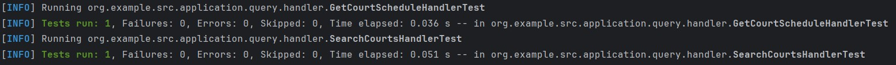
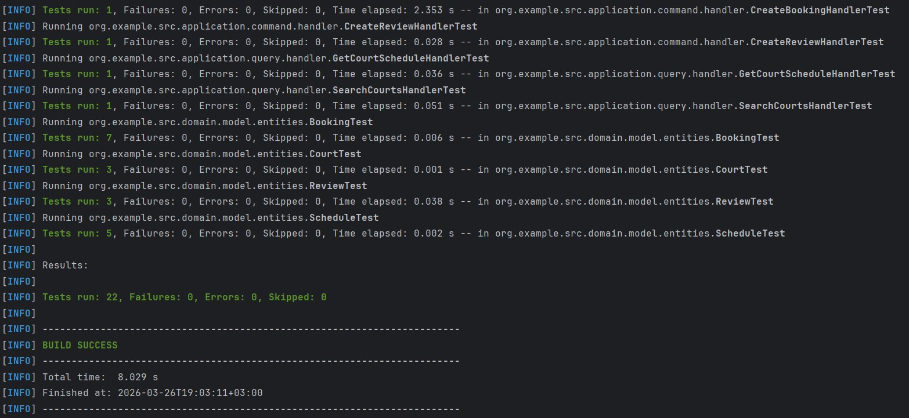

<p align="center">Министерство образования Республики Беларусь</p>
<p align="center">Учреждение образования</p>
<p align="center">"Брестский Государственный технический университет"</p>
<p align="center">Кафедра ИИТ</p>
<br><br><br><br><br><br>
<p align="center"><strong>Лабораторная работа №4</strong></p>
<p align="center"><strong>По дисциплине:</strong> "Проектирование интернет-систем"</p>
<p align="center"><strong>Тема:</strong> "Application Layer: Commands, Queries, Handlers"</p>
<br><br><br><br><br><br>
<p align="right"><strong>Выполнил:</strong></p>
<p align="right">Студент 3 курса</p>
<p align="right">Группа ПО-13</p>
<p align="right">Шумило М.А.</p>
<p align="right"><strong>Проверил:</strong></p>
<p align="right">Шорох Д.В.</p>
<br><br><br><br><br>
<p align="center"><strong>Брест 2026</strong></p>

---

## Цель работы

Реализовать **прикладной слой** (Application Layer) с разделением операций на **команды** (изменяют состояние) и **запросы** (читают данные) по паттерну CQRS.

---

## Вариант №23 - Спортплощадки «Играем?» 🏀

**Питч:** Игра начнётся, как только вы забронируете.

**Ядро домена:** Площадки, Расписание, Брони, Отзывы

---

## Ход выполнения работы

### 1. Команды (Commands)

**Созданные команды:**

1. **_CreateBookingCommand_** - _команда создания брони_
   - Поля: `courtId, userId, start, end`
   - Валидация: courtId > 0, userId > 0, start != null, end != null, end.isAfter(start)
   - Файл: `application/command/CreateBookingCommand.java`

1. **_CreateReviewCommand_** - _команда создания отзыва_
   - Валидация примитивов: courtId > 0, userId > 0, rating в диапазоне 1..5, text не пустой
   - Поля: `courtId, userId, rating, text`
   - Файл: `application/command/CreateReviewCommand.java`

**Пример кода команды:**
```java
public final class CreateBookingCommand {
  private final Long courtId;
  private final Long userId;
  private final LocalDateTime start;
  private final LocalDateTime end;

  public CreateBookingCommand(Long courtId, Long userId,
                              LocalDateTime start, LocalDateTime end) {
    if (courtId == null || courtId <= 0) throw new IllegalArgumentException();
    if (userId == null || userId <= 0) throw new IllegalArgumentException();
    if (start == null || end == null) throw new IllegalArgumentException();
    if (!end.isAfter(start)) throw new IllegalArgumentException();

    this.courtId = courtId;
    this.userId = userId;
    this.start = start;
    this.end = end;
  }

  public Long getCourtId() { return courtId; }
  public Long getUserId() { return userId; }
  public LocalDateTime getStart() { return start; }
  public LocalDateTime getEnd() { return end; }
}
```

---

### 2. Command Handlers

**Созданные обработчики:**

1. **_CreateBookingHandler_** - _обработчик создания брони_
   - Шаги обработки: 
     - Валидация входных данных (внутри команды)  
     - Создание value object `TimeSlot`  
     - Создание доменного объекта `Booking`  
     - Сохранение через `BookingRepository`  
     - (опционально) публикация доменных событий  
   - Возвращает: _BookingID_
   - Файл: `application/command/handlers/CreateBookingHandler.java`

2. **_CreateReviewHandler_** - _обработчик создания отзыва_
   - Шаги: 
     - Валидация входных данных (внутри команды)  
     - Создание доменного объекта `Review`  
     - Сохранение через `ReviewRepository`  
     - (опционально) публикация доменных событий  
   - - Возвращает: _ReviewID_
   - Файл: `application/command/handlers/CreateReviewHandler.java`

**Пример кода handler:**
```java
public class CreateBookingHandler {

  private final BookingRepository bookingRepository;

  public CreateBookingHandler(BookingRepository bookingRepository) {
    this.bookingRepository = bookingRepository;
  }

  public Booking handle(CreateBookingCommand command) {

    TimeSlot slot = new TimeSlot(
      command.getStart(),
      command.getEnd()
    );

    Booking booking = new Booking(
      null,
      command.getCourtId(),
      command.getUserId(),
      slot
    );

    return bookingRepository.save(booking);
  }
}
```

**Скриншот теста:**



---
### 3. Queries (Запросы)

**Созданные запросы:**

1. **_SearchCourtsQuery_** - _поиск площадок по имени_
   - Поля: `String text`
   - Файл: `application/query/SearchCourtsQuery.java`

2. **_GetCourtScheduleQuery_** - _получение расписания площадки_
   - Поля: `_Long courtId_`
   - Файл: `application/query/GetCourtScheduleQuery.java`


**Пример кода:**
```java
public final class GetCourtScheduleQuery {

  private final Long courtId;

  public GetCourtScheduleQuery(Long courtId) {
    if (courtId == null || courtId <= 0) {
      throw new IllegalArgumentException("courtId must be positive");
    }
    this.courtId = courtId;
  }

  public Long getCourtId() {
    return courtId;
  }
}

```

---

### 4. Query Handlers

**Созданные обработчики запросов:**

1. **_SearchCourtsHandler_** - _обработчик поиска площадок_
   - Репозиторий: `CourtRepository`
   - Возвращает: `List<Court>`
   - Файл: `application/query/handler/SearchCourtsHandler.java`
  
2. **_GetCourtScheduleHandler_** - _обработчик получения расписания_
   - Репозиторий: `ScheduleRepository`
   - Возвращает: `Schedule`
   - Файл: `application/query/handler/GetCourtScheduleHandler.java`

**Пример кода:**
```java
public class SearchCourtsHandler {

  private final CourtRepository courtSearchRepository;

  public SearchCourtsHandler(CourtRepository courtSearchRepository) {
    this.courtSearchRepository = courtSearchRepository;
  }

  public List<Court> handle(SearchCourtsQuery query) {
    return courtSearchRepository.searchByName(query.getText());
  }
}


```

**Скриншот:**



---

### 5. Application Service (Фасад)

**Реализованный сервис:** `ScheduleService`

**Методы:**

| Метод | Тип | Возвращает |
| --- | --- | --- |
| ``getSchedule(courtId)`` | Query | ``Schedule`` |

**Пример кода:**
```java
public class ScheduleService implements GetCourtScheduleUseCase {
  private final GetCourtScheduleHandler handler;

  public ScheduleService(GetCourtScheduleHandler handler) {
    this.handler = handler;
  }
  @Override
  public Schedule getSchedule(Long courtId) {
      return handler.handle(new GetCourtScheduleQuery(courtId));
  }
}

```

---

### 6. Тестирование

**Юнит-тесты:**

| Тест | Что проверяет | Статус |
| --- | --- | --- |
| ``test_create_handler`` | Создание агрегата через Command Handler, вызов ``save()`` в репозитории | ✅ |
| ``test_handler_publishes_events`` | Генерация доменных событий (``BookingCreatedEvent``, ``ReviewEditedEvent``, ``CourtRenamedEvent``, ``ScheduleLockedEvent`` и др.) | ✅ |
| ``test_query_handler_success`` | Корректная обработка Query Handler, возврат данных, вызов репозитория | ✅ |
| ``test_query_handler_not_found`` | Обработка ситуации, когда данные отсутствуют (null/empty) | ✅ |
| ``test_service_delegates_to_handler`` | Проверка, что Application Service создаёт Query/Command и делегирует вызов Handler'у | ✅ |
| ``test_domain_validation`` | Проверка валидации доменных объектов (некорректные ID, пересечение тайм‑слотов, отрицательный рейтинг и т.д.) | ✅ |
| ``test_domain_state_transitions`` | Проверка переходов состояний агрегатов (``confirm()``, ``cancel()``, ``complete()``, ``lock()``, ``unlock()``) | ✅ |
| ``test_value_object_validation`` | Проверка корректности value‑objects (``TimeSlot``, ``ReviewText``, ``CourtName``, ``Location``) | ✅ |
| ``test_query_input_validation`` | Проверка валидации входных Query (``courtId ``> ``0``, ``text ``not ``blank``) | ✅ |
**Скриншот mwn test:**



---

## Таблица критериев оценки

| Критерий | Баллы | Выполнено |
|----------|-------|-----------|
| Команды (DTOs): иммутабельность, валидация примитивов | 15 |  ✅ |
| Command Handlers: транзакции, события, сохранение | 25 |  ✅ |
| Запросы (DTOs): read-модели без побочных эффектов | 10 |  ✅ |
| Query Handlers: преобразование домена в DTO | 15 | ✅ |
| Application Service (фасад): делегирование | 20 |  ✅ |
| Юнит-тесты handlers: mocker, события | 10 |  ✅ |
| Качество документации | 5 |  ✅ |
| **ИТОГО** | **100** | |

---

## Бонусы

| Бонус | Баллы | Выполнено |
|-------|-------|-----------|
| REST API контроллер (HTTP endpoints) | +5 | ❌  |
| Bean Validation (@NotBlank, @Valid) | +4 | ❌ |
| Exception Handling (глобальный обработчик) | +3 | ❌  |
| OpenAPI документация (Swagger) | +3 | ❌  |

**ИТОГО бонусов:** 0 / 15

---

## Контрольные вопросы

1. **В чём разница между Command и Query?**
   - Command изменяет состояние, Query только читает
   - Command возвращает void/ID, Query возвращает DTO

2. **Почему Command Handler возвращает только ID, а не весь объект?**
   - Избежать утечки доменной модели наружу
   - Клиент должен делать отдельный GET-запрос (CQRS)

3. **Где должна выполняться валидация: в команде, обработчике или доменной модели?**
   - **Примитивы** - в команде/обработчике (NotBlank, Positive)
   - **Инварианты** - в доменной модели (количество участников группы)

4. **Можно ли вызывать Query из Command Handler?**
   - Технически можно, но **не рекомендуется** (нарушает CQRS)
   - Лучше загружать данные через Repository

5. **Зачем разделять Request DTO (от клиента) и Command (внутренний)?**
   - Request DTO - HTTP/JSON формат
   - Command - внутренняя структура приложения
   - Разделение позволяет независимо менять API и бизнес-логику

---

## Ссылка на репозиторий

👉 **GitHub:**  [URL репозитория](https://github.com/AllFather88/PIS-2026/)

**Структура папки:**
```
lab-04/
├── Отчет.md
├── application/
│   ├── command/
│   │   ├── CreateBookingCommand.java
│   │   ├── CreateReviewCommand.java
│   │   └── handler/
│   │       ├── CreateBookingHandler.java
│   │       └── CreateReviewHandler.java
│   │
│   ├── query/
│   │   ├── SearchCourtsQuery.java
│   │   ├── GetCourtScheduleQuery.java
│   │   └── handler/
│   │       ├── SearchCourtsHandler.java
│   │       └── GetCourtScheduleHandler.java
│   │
│   ├── port/
│   │   ├── in/
│   │   │   ├── CreateBookingUseCase.java
│   │   │   ├── CreateReviewUseCase.java
│   │   │   ├── SearchCourtsUseCase.java
│   │   │   └── GetCourtScheduleUseCase.java
│   │   └── out/
│   │       ├── BookingRepository.java
│   │       ├── ReviewRepository.java
│   │       ├── CourtRepository.java
│   │       └── ScheduleRepository.java
│   │
│   ├── service/
│   │   ├── BookingService.java
│   │   ├── ReviewService.java
│   │   ├── CourtService.java
│   │   └── ScheduleService.java
│
└── tests/
    ├── CreateBookingHandlerTest.java
    ├── CreateReviewHandlerTest.java
    ├── SearchCourtsHandlerTest.java
    └── GetCourtScheduleHandlerTest.java
```

---

## Вывод

В ходе работы была реализована полноценная архитектура прикладного слоя, основанная на разделении команд и запросов (CQRS). Созданы и протестированы Command Handlers, Query Handlers, а также фасадные Application Services, которые делегируют выполнение специализированным обработчикам. Команды и запросы являются иммутабельными объектами, что обеспечивает предсказуемость и безопасность данных.

Доменная модель корректно генерирует события при изменении состояния агрегатов, а тесты подтверждают правильность этих переходов. Все ключевые сценарии — создание сущностей, обработка запросов, валидация данных, публикация событий и делегирование сервисов — покрыты юнит‑тестами.


---

**Дата выполнения:** _26.03.2026_  
**Оценка:** _____________  
**Подпись преподавателя:** _____________
