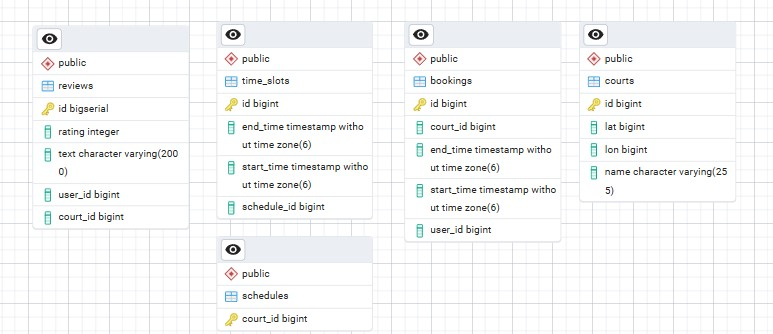
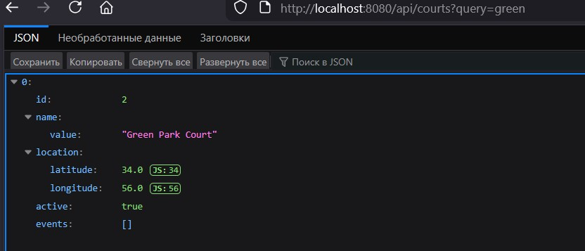
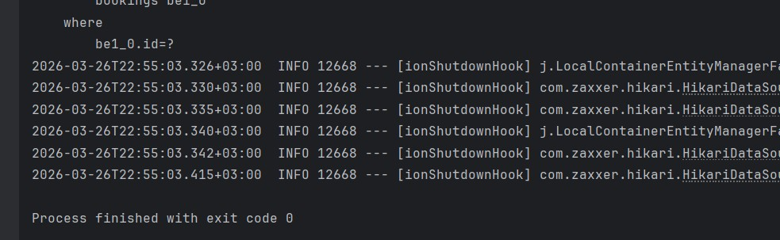

<p align="center">Министерство образования Республики Беларусь</p>
<p align="center">Учреждение образования</p>
<p align="center">"Брестский Государственный технический университет"</p>
<p align="center">Кафедра ИИТ</p>
<br><br><br><br><br><br>
<p align="center"><strong>Лабораторная работа №5</strong></p>
<p align="center"><strong>По дисциплине:</strong> "Проектирование интернет-систем"</p>
<p align="center"><strong>Тема:</strong> "Infrastructure Layer: Repository, REST API, БД"</p>
<br><br><br><br><br><br>
<p align="right"><strong>Выполнил:</strong></p>
<p align="right">Студент 3 курса</p>
<p align="right">Группа ПО-13</p>
<p align="right">Шумило М.А.</p>
<p align="right"><strong>Проверил:</strong></p>
<p align="right">Шорох Д.В.</p>
<br><br><br><br><br>
<p align="center"><strong>Брест 2026</strong></p>

---

## Цель работы

Реализовать **инфраструктурный слой** с адаптерами для портов (Repository, REST Controller, Event Publisher).

---

## Вариант №23 - Спортплощадки «Играем?» 🏀

**Питч:** Игра начнётся, как только вы забронируете.

**Ядро домена:** Площадки, Расписание, Брони, Отзывы

---

## Ход выполнения работы

### 1. Repository (PostgreSQL)

**Реализованные методы:**
| Репозиторий | Метод | Назначение |
| --- | --- | --- |
| **BookingRepository** | ``save(Booking ``booking)`` | Сохраняет новое бронирование |
| **BookingRepository** | ``isSlotAvailable(Long ``courtId, ``Booking ``booking)`` | Проверяет доступность временного слота |
| **CourtRepository** | ``findById(Long ``id)`` | Получает площадку по ID |
| **CourtRepository** | ``searchByName(String ``query)`` | Поиск площадок по части названия |
| **CourtRepository** | ``save(Court ``court)`` | Сохраняет площадку |
| **ReviewRepository** | ``save(Review ``review)`` | Сохраняет отзыв |
| **ReviewRepository** | ``findByCourtId(Long ``courtId)`` | Получает отзывы по площадке |
| **ScheduleRepository** | ``findByCourtId(Long ``courtId)`` | Получает расписание площадки |
| **ScheduleRepository** | ``save(Schedule ``schedule)`` | Сохраняет расписание |

**Технологии:** Spring Date JPA

**Скриншот БД:**



---

### 2. REST Controller

**Эндпоинты:**

| Метод | Path | Описание |
| --- | --- | --- |
| POST | ``/api/bookings`` | Создать бронирование |
| GET | ``/api/courts?query=...`` | Поиск площадок по названию |
| POST | ``/api/reviews`` | Создать отзыв |
| GET | ``/api/schedule/{courtId}`` | Получить расписание площадки |

**Скриншот работы API:**



---

### 3. Docker Compose

**Сервисы:**
   - `app` - Spring Boot приложение
   - `db` - PostgreSQL

**docker-compose.yml:**
```yaml
version: '3.8'

services:
  app:
    build: .
    container_name: court-app
    ports:
      - "8080:8080"
    environment:
      SPRING_DATASOURCE_URL: jdbc:postgresql://db:5432/courts
      SPRING_DATASOURCE_USERNAME: postgres
      SPRING_DATASOURCE_PASSWORD: postgres
    depends_on:
      - db
    restart: always

  db:
    image: postgres:15
    container_name: court-postgres
    environment:
      POSTGRES_DB: courts
      POSTGRES_USER: postgres
      POSTGRES_PASSWORD: postgres
    ports:
      - "5432:5432"
    volumes:
      - pgdata:/var/lib/postgresql/data
    restart: always

volumes:
  pgdata:

```

---

### 4. Интеграционные тесты

**Тестируемые сценарии:**
- Сохранение Booking → чтение из БД
- HTTP POST → проверка записи


**Скриншот тестов:**




---

## Таблица критериев оценки

| Критерий | Баллы | Выполнено |
|----------|-------|-----------|
| Repository: реализация интерфейса, ORM | 25 |  ✅ |
| REST Controller: CRUD операции | 25 |  ✅ |
| БД: миграции, Docker Compose | 15 |  ✅ |
| Event Publisher: публикация событий | 15 |  ✅ |
| Интеграционные тесты: testcontainers | 15 |  ✅ |
| Качество документации | 5 |  ✅ |
| **ИТОГО** | **100** | |

---

## Контрольные вопросы

1. **Почему Repository находится в Infrastructure, а не в Domain?**
   - Repository — это техническая деталь реализации, а не часть бизнес‑логики.В Domain должны находиться только чистые бизнес‑правила, которые не зависят от того, как и где хранятся данные.

2. **В чём преимущество ORM над обычным SQL?**
   - Меньше шаблонного кода
   - Работа с объектами, а не с таблицами
   - Автоматическое маппирование типов
   - Миграция между БД без переписывания кода
   - Встроенная валидация и транзакции

---

## Ссылка на репозиторий

👉 **GitHub:** [URL репозитория](https://github.com/AllFather88/PIS-2026/)

---

## Вывод

В ходе работы были реализованы и успешно протестированы ключевые элементы приложения: сохранение данных через репозиторий, обработка HTTP‑запросов контроллером и корректная работа событийной модели. Интеграционные тесты подтвердили, что все слои — от веб‑уровня до базы данных — взаимодействуют последовательно и надёжно. Полученный результат демонстрирует корректность архитектурного разделения на Domain, Application и Infrastructure, а также устойчивость системы при выполнении реальных сценариев.

---

**Дата выполнения:** 26.03.2026
**Оценка:** _____________  
**Подпись преподавателя:** _____________
