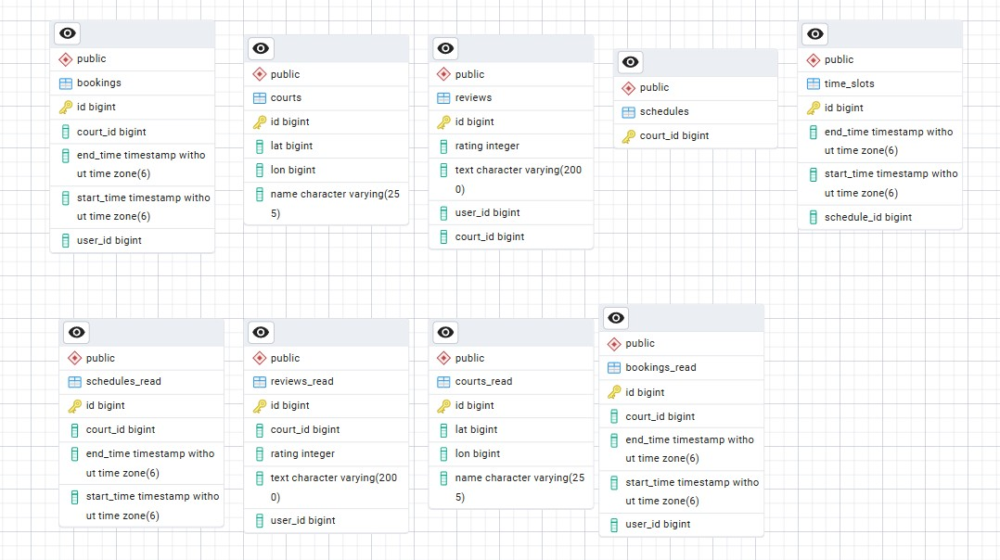

<p align="center">Министерство образования Республики Беларусь</p>
<p align="center">Учреждение образования</p>
<p align="center">"Брестский Государственный технический университет"</p>
<p align="center">Кафедра ИИТ</p>
<br><br><br><br><br><br>
<p align="center"><strong>Лабораторная работа №7</strong></p>
<p align="center"><strong>По дисциплине:</strong> "Проектирование интернет-систем"</p>
<p align="center"><strong>Тема:</strong> "CQRS и Read Models"</p>
<br><br><br><br><br><br>
<p align="right"><strong>Выполнил:</strong></p>
<p align="right">Студент 3 курса</p>
<p align="right">Группа ПО-13</p>
<p align="right">Шумило М.А.</p>
<p align="right"><strong>Проверил:</strong></p>
<p align="right">Шорох Д.В.</p>
<br><br><br><br><br>
<p align="center"><strong>Брест 2026</strong></p>

---

## Цель работы

Реализовать CQRS с разделением Write Model и Read Model.

---


## Вариант №23 - Спортплощадки «Играем?» 🏀

**Питч:** Игра начнётся, как только вы забронируете.

**Ядро домена:** Площадки, Расписание, Брони, Отзывы

---

## Ход выполнения работы

### 1. Write Model

**Агрегат:** Schedule

**Структура:**
- Нормализованные таблицы
- Инварианты

---

### 2. Read Model

**Проекция:** Schedule

**Структура:**
- Денормализованная таблица
- JOIN предзагруженные

**Скриншот БД:**




---

### 3. Event-Driven Sync

**События:**
- `BookingCreatedEvent` → создать BookingView
- `CreateReviewEvent` → создать ReviewView

**Код:**
```java
public class BookingProjection {

    private final BookingReadJpaRepository repo;

    public BookingProjection(BookingReadJpaRepository repo) {
        this.repo = repo;
    }

    public void on(BookingCreatedEvent e) {
        BookingReadEntity b = new BookingReadEntity();
        b.setId(e.getBookingId());
        b.setUserId(e.getUserId());
        b.setCourtId(e.getCourtId());
        b.setStartTime(e.getStart());
        b.setEndTime(e.getEnd());
        repo.save(b);
    }
}

```

---

## Таблица критериев оценки

| Критерий | Баллы | Выполнено |
|----------|-------|-----------|
| Write Model | 20 |  ✅ |
| Read Model | 25 |  ✅ |
| Event-Driven Sync | 25 | ✅ |
| Оптимизация запросов | 15 |  ✅ |
| Тесты проекций | 10 |  ✅ |
| Качество документации | 5 |  ✅ |
| **ИТОГО** | **100** | |

---

## Вывод

В ходе работы была реализована архитектура CQRS, основанная на полном разделении Write Model и Read Model.
Write‑модель отвечает за выполнение команд, изменение состояния и генерацию доменных событий, а Read‑модель — за формирование проекций и оптимизацию операций чтения.

---

**Дата выполнения:** 27.03.2026  
**Оценка:** _____________  
**Подпись преподавателя:** _____________
