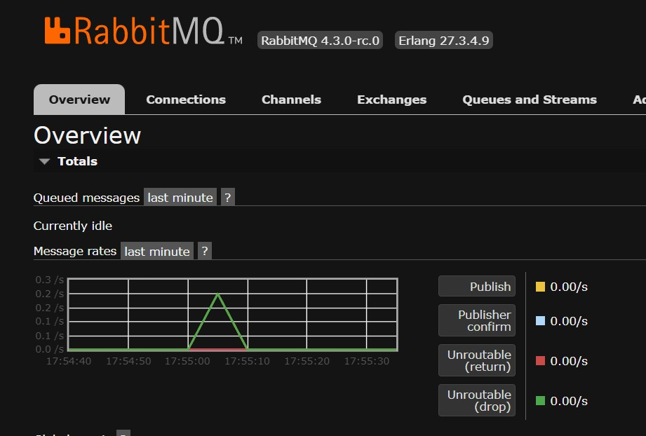

<p align="center">Министерство образования Республики Беларусь</p>
<p align="center">Учреждение образования</p>
<p align="center">"Брестский Государственный технический университет"</p>
<p align="center">Кафедра ИИТ</p>
<br><br><br><br><br><br>
<p align="center"><strong>Лабораторная работа №8</strong></p>
<p align="center"><strong>По дисциплине:</strong> "Проектирование интернет-систем"</p>
<p align="center"><strong>Тема:</strong> "Микросервисы и Event Bus"</p>
<br><br><br><br><br><br>
<p align="right"><strong>Выполнил:</strong></p>
<p align="right">Студент 3 курса</p>
<p align="right">Группа ПО-13</p>
<p align="right">Шумило М.А.</p>
<p align="right"><strong>Проверил:</strong></p>
<p align="right">Шорох Д.В.</p>
<br><br><br><br><br>
<p align="center"><strong>Брест 2026</strong></p>

---

## Цель работы

Разбить монолит на микросервисы с асинхронной коммуникацией.

---

## Вариант №23 - Спортплощадки «Играем?» 🏀

**Питч:** Игра начнётся, как только вы забронируете.

**Ядро домена:** Площадки, Расписание, Брони, Отзывы


---

## Ход выполнения работы

### 1. Booking Service

**Bounded Context:** Управление бронями

**API:**
- POST /api/bookings

---

### 2. Review Service

**Bounded Context:** Управление отзывами

**API:**
- POST /api/reviews

### 3. Get Service

**Bounded Context:** Сервис получения данных

**API:**
- GET /api/get/courts
- GET /api/get/schedule


---

### 3. Event Bus (RabbitMQ)

**События:**
- `CreateReviewEvent`
- `BookingCreatedEvent`

**Скриншот RabbitMQ Management:**




---

### 4. API Gateway

**Маршрутизация:**
- `/api/reviews/**` → Review Service
- `/api/bookings/**` → Booking Service
- `/api/get/**` →  Get Service

**Конфигурация:**
```nginx
events {}

http {
    proxy_set_header Host $host;
    proxy_set_header X-Real-IP $remote_addr;
    proxy_set_header X-Forwarded-For $proxy_add_x_forwarded_for;
    proxy_set_header X-Forwarded-Proto $scheme;

    upstream booking_service {
        server booking-service:8080;
    }

    upstream review_service {
        server review-service:8081;
    }

    upstream get_service {
        server get-service:8082;
    }

    server {
        listen 80;
      
        # Booking Service
        location /api/bookings/ {
            proxy_pass http://booking_service;
        }

        # Review Service
        location /api/reviews/ {
            proxy_pass http://review_service;
        }

        # Get Service
        location /api/get/ {
            proxy_pass http://get_service;
        }
    }
}

```

---

## Таблица критериев оценки

| Критерий | Баллы | Выполнено |
|----------|-------|-----------|
| Request Service: bounded context | 20 |  ✅ |
| Group Service: CRUD | 15 |  ✅ |
| Event Bus: RabbitMQ/Kafka | 25 |  ✅ |
| API Gateway | 15 | ✅ |
| Circuit Breaker | 15 |  ✅ |
| Docker Compose | 5 | ✅ |
| Качество документации | 5 | ✅ |
| **ИТОГО** | **100** | |

---

## Вывод

В ходе выполнения лабораторной работы была проведена декомпозиция монолитного приложения на независимые микросервисы, каждый из которых отвечает за свой bounded context. Были выделены три сервиса: Booking Service, Review Service и Get Service, что позволило разделить ответственность и упростить дальнейшее развитие системы.
Для обеспечения асинхронного взаимодействия между сервисами был интегрирован RabbitMQ как Event Bus. 

---

**Дата выполнения:** _[Дата]_  
**Оценка:** _____________  
**Подпись преподавателя:** _____________
