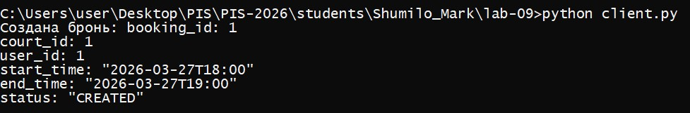
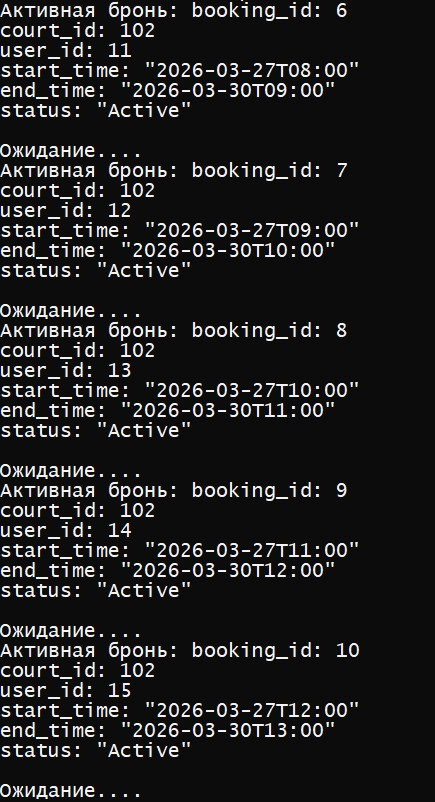

<p align="center">Министерство образования Республики Беларусь</p>
<p align="center">Учреждение образования</p>
<p align="center">"Брестский Государственный технический университет"</p>
<p align="center">Кафедра ИИТ</p>
<br><br><br><br><br><br>
<p align="center"><strong>Лабораторная работа №9</strong></p>
<p align="center"><strong>По дисциплине:</strong> "Проектирование интернет-систем"</p>
<p align="center"><strong>Тема:</strong> "Protocol Buffers и gRPC"</p>
<br><br><br><br><br><br>
<p align="right"><strong>Выполнил:</strong></p>
<p align="right">Студент 3 курса</p>
<p align="right">Группа ПО-13</p>
<p align="right">Шумило М.А.</p>
<p align="right"><strong>Проверил:</strong></p>
<p align="right">Шорох Д.В.</p>
<br><br><br><br><br>
<p align="center"><strong>Брест 2026</strong></p>

---

## Цель работы

Заменить REST API на gRPC для межсервисной коммуникации.

---

## Вариант №23 - Спортплощадки «Играем?» 🏀

**Питч:** Игра начнётся, как только вы забронируете.

**Ядро домена:** Площадки, Расписание, Брони, Отзывы

---

## Ход выполнения работы

### 1. Протофайлы (.proto)

**system.proto:**
```protobuf
syntax = "proto3";

package tennis;

option java_multiple_files = true;
option java_package = "org.example.grpc";
option java_outer_classname = "TennisProto";


//  BOOKING SERVICE
service BookingService {
  rpc CreateBooking(CreateBookingRequest) returns (BookingDto);
  rpc GetBooking(GetBookingRequest) returns (BookingDto);

  // server-side streaming
  rpc StreamActiveBookings(StreamActiveBookingsRequest)
      returns (stream BookingDto);
}

message CreateBookingRequest {
  int64 court_id = 1;
  int64 user_id = 2;
  string start_time = 3; // ISO-8601
  string end_time = 4;
}

message GetBookingRequest {
  int64 booking_id = 1;
}

message StreamActiveBookingsRequest {
  int64 court_id = 1;
}

message BookingDto {
  int64 booking_id = 1;
  int64 court_id = 2;
  int64 user_id = 3;
  string start_time = 4;
  string end_time = 5;
  string status = 6;
}


//  SCHEDULE SERVICE
service ScheduleService {
  rpc GetSchedule(GetScheduleRequest) returns (ScheduleResponse);
}

message GetScheduleRequest {
  int64 court_id = 1;
}

message ScheduleResponse {
  repeated TimeSlot slots = 1;
}

message TimeSlot {
  string start = 1;
  string end = 2;
  bool available = 3;
}


//  REVIEW SERVICE
service ReviewService {
  rpc CreateReview(CreateReviewRequest) returns (ReviewDto);
}

message CreateReviewRequest {
  int64 court_id = 1;
  int64 user_id = 2;
  int32 rating = 3;
  string text = 4;
}

message ReviewDto {
  int64 review_id = 1;
  int64 court_id = 2;
  int64 user_id = 3;
  int32 rating = 4;
  string text = 5;
}


//  COURT SEARCH SERVICE
service CourtService {
  rpc SearchCourts(SearchCourtsRequest) returns (SearchCourtsResponse);
}

message SearchCourtsRequest {
  string query = 1;
}

message SearchCourtsResponse {
  repeated CourtDto courts = 1;
}

message CourtDto {
  int64 court_id = 1;
  string name = 2;
  string address = 3;
}

```

---

### 2. gRPC Server

**Реализованные методы:**
- `streamActiveBookings`(server streaming)
- `createBooking`
- `searchCourts` 
- `getSchedule` 
- `createReview` 

**Код:**
```java
@GrpcService
public class BookingGrpcService extends BookingServiceGrpc.BookingServiceImplBase {

    private final CreateBookingUseCase bookingService;

    public BookingGrpcService(CreateBookingUseCase bookingService) {
        this.bookingService = bookingService;
    }


    @Override
    public void createBooking(org.example.grpc.CreateBookingRequest request, StreamObserver<BookingDto> responseObserver) {
        var cmd = new CreateBookingCommand(
                request.getCourtId(),
                request.getUserId(),
                LocalDateTime.parse(request.getStartTime()),
                LocalDateTime.parse(request.getEndTime())
        );

        var booking = bookingService.create(cmd);

        BookingDto response = BookingDto.newBuilder()
                .setBookingId(booking.getId())
                .setCourtId(booking.getCourtId())
                .setUserId(booking.getUserId())
                .setStartTime(booking.getSlot().start().toString())
                .setEndTime(booking.getSlot().end().toString())
                .setStatus(booking.getStatus().name())
                .build();

        responseObserver.onNext(response);
        responseObserver.onCompleted();
    }


    @Override
    public void streamActiveBookings(StreamActiveBookingsRequest request,
                                     StreamObserver<BookingDto> responseObserver) {
        var active = bookingService.getActiveBookings(request.getCourtId());
        System.out.println(active.size());
        active.forEach(b -> {
            BookingDto dto = BookingDto.newBuilder()
                    .setBookingId(b.getId())
                    .setCourtId(b.getCourtId())
                    .setUserId(b.getUserId())
                    .setStartTime(b.getStartTime().toString())
                    .setEndTime(b.getEndTime().toString())
                    .setStatus("Active")
                    .build();

            responseObserver.onNext(dto);
        });
        responseObserver.onCompleted();
    }
}
```

---

### 3. gRPC Client

**Тест вызова:**
```python
import grpc
import system_pb2
import system_pb2_grpc

def create_booking():
    channel = grpc.insecure_channel("localhost:9090")
    client = system_pb2_grpc.BookingServiceStub(channel)

    request = system_pb2.CreateBookingRequest(
        court_id=1,
        user_id=1,
        start_time="2026-03-27T18:00",
        end_time="2026-03-27T19:00"
    )

    response = client.CreateBooking(request)
    print("Создана бронь:", response)

if __name__ == "__main__":
    create_booking()

```

**Скриншот:**



---

### 4. Server-Side Streaming

**Сценарий:**
Клиент подписывается на активные брони → сервер отправляет обновления в real-time.

**Скриншот:**



---

## Таблица критериев оценки

| Критерий | Баллы | Выполнено |
|----------|-------|-----------|
| Протофайлы (.proto) | 20 |  ✅ |
| gRPC Server | 25 |  ✅ |
| gRPC Client | 20 |  ✅ |
| Streaming | 20 |  ✅ |
| Генерация кода (protoc) | 10 |  ✅ |
| Качество документации | 5 |  ✅ |
| **ИТОГО** | **100** | |

---

## Контрольные вопросы

1. **В чём преимущество gRPC над REST?**
   - использует Protocol Buffers, а не текстовый JSON
   - работает поверх HTTP/2, что даёт мультиплексирование и стримы
   - генерирует клиентский и серверный код автоматически
   - поддерживает стриминг (server-side, client-side, bidirectional)
   - обеспечивает строгую типизацию и контракт между сервисами

2. **Почему Protocol Buffers быстрее JSON?**
   - Protobuf — бинарный формат, JSON — текстовый
   - сериализация/десериализация Protobuf выполняется в разы быстрее
   - размер сообщений Protobuf в 5–10 раз меньше
   - структура строго типизирована → нет лишнего парсинга
   - Protobuf заранее компилируется в классы → нет динамической обработки

3. **Зачем нужен streaming в gRPC?**
   - отправлять много сообщений в одном запросе
   - передавать данные по мере их появления, а не ждать весь результат
   - уменьшать задержки и повышать отзывчивость
   - реализовывать реальное время: обновления, события, нотификации
   - экономить ресурсы, не создавая тысячи отдельных HTTP‑запросов

---

## Ссылка на репозиторий

👉 **GitHub:** [URL репозитория](https://github.com/AllFather88/PIS-2026/)

---

## Вывод

В ходе лабораторной работы был реализован сервис на основе gRPC, использующий Protocol Buffers для обмена данными. В процессе были изучены основные преимущества gRPC по сравнению с REST, особенности бинарной сериализации Protobuf и механизм работы server‑side streaming. Также был создан сервер, клиент и настроена генерация кода для разных языков. Работа позволила закрепить навыки построения высокопроизводительных микросервисов, освоить строгую типизацию контрактов и понять преимущества потоковой передачи данных в распределённых системах.

---

**Дата выполнения:** 27.03.2026

**Оценка:** _____________  
**Подпись преподавателя:** _____________
